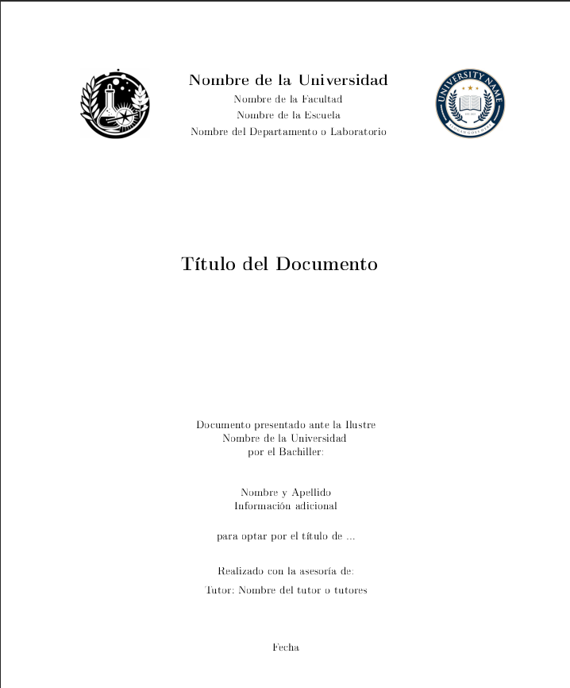
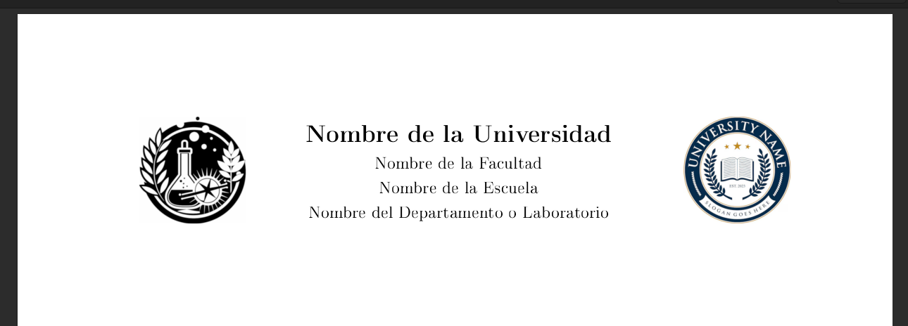
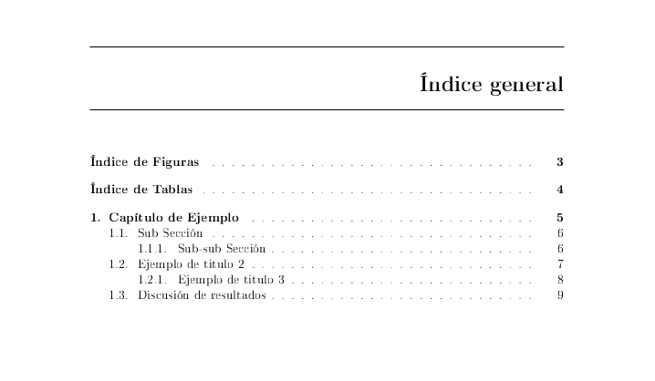
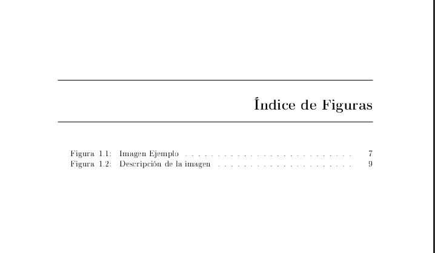
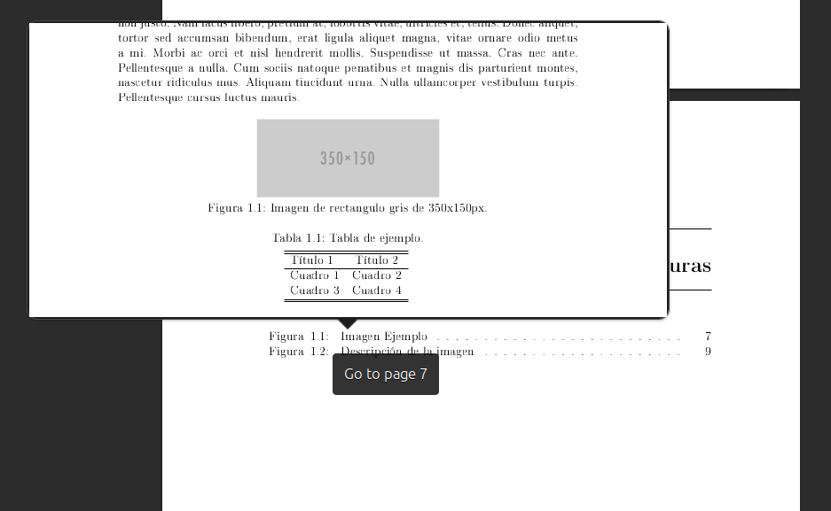
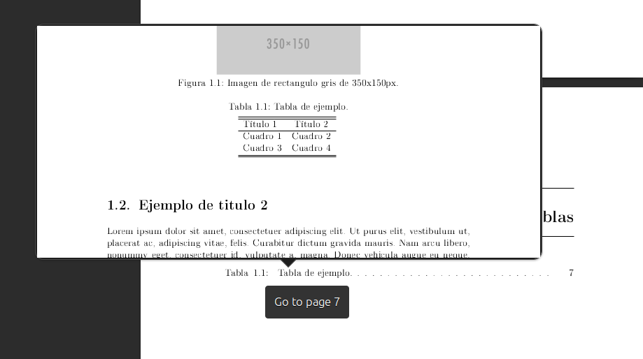
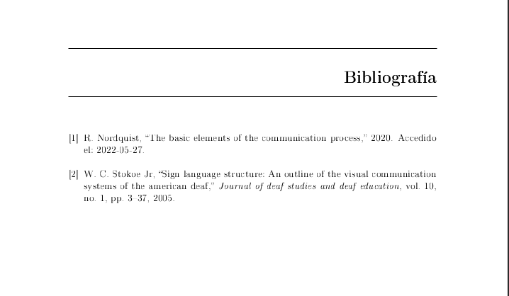

### Book

The dasesu_book.cls file contains the definitions and settings that will shape
the document

To generate the pdf file:
```sh
pdflatex libro.tex # this will generate a document with question marks in place
                   # of unknown references
bibtex libro.aux   # this will parse all the .bib files that were included in the
                   # document and generate meta information regarding references
pdflatex libro.tex # this will generate the document with all the references in
                   # the correct place 
pdflatex libro.tex # just in case if adding references broke page numbering
                   # somewhere
```

In the root directory is the file `libro.tex`, this file is the one that
contains the calls to each part of the document

In the `parts` directory you have some documents corresponding to each of these
parts.

* portada.tex: This file is the cover of the document 
* cabecera-logos.tex: Contain the Instutuion name and logos used in the cover.
* capitulo1.tex: This is an example of chapter, here you can find also references, footnotes, figures, tables and list.
* bibliografia.bib: The bibliography, you can change the content for adapt it to  your document

Once generated, the document looks as shown bellow  

Aspect of the cover  


The header logos can be change in the cabecera-logos file  


The table of content include a link for table of figures and table of tables  


The table of figures pre-append the word `Figure <number>:`  


Preview of link  




Aspect of the Bibliography  

